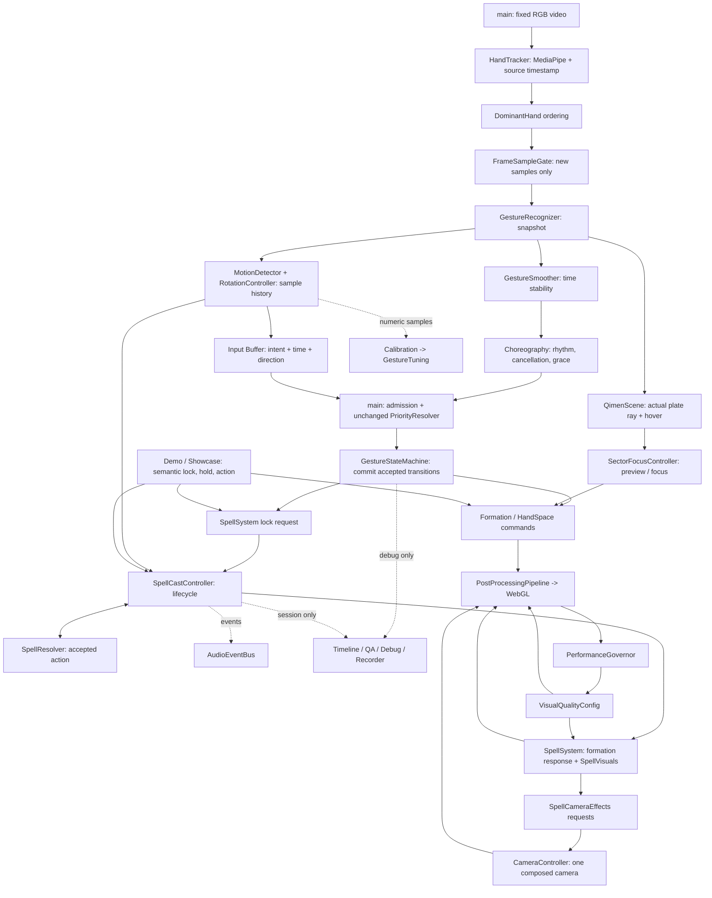

# Phase 4.95 — architecture and runtime audit

审计完成（2026-09-22）。基线完整阅读 **51 个原有 TypeScript 模块**，以及 CSS、HTML、package/TypeScript/Vite 配置、资源同步脚本和 README。其中 `QimenDisc`、`DomainField` 为未接入主入口的历史实现。目录没有 Git 仓库，无法提供相对历史提交的 diff；本次从 Phase 4.9 文件现场继续，未重建该阶段功能。新增 4 个运行时辅助模块及 Vite 类型声明。未进行真人摄像头测试，未声明真实成功率、真实延迟或 GPU 五分钟稳定性。

## Baseline runtime / ownership

Camera acquisition lives in main → HandTracker owns the MediaPipe instance and cached frame → DominantHandController orders hands → GestureRecognizer classifies → GestureSmoother stabilizes. MotionDetector and RotationController independently maintain measurement histories. main calls Choreography and PriorityResolver before StateMachine, but rejects some emitted events **after** StateMachine has committed state. main then writes selection and formation commands, calls SpellSystem → SpellCastController → SpellResolver, and dispatches audio/QA. QimenScene updates Animator → Formation → SpellVisuals → HandSpace → CameraController → PostProcessingPipeline → renderer.

Demo bypasses camera/gesture states and calls forceReady via debugCast. Showcase reuses this demo. Debug/QA are observers in intent, but baseline performs much of their formatting and collection with Debug OFF. Calibration writes GestureTuning; Governor writes render quality, not recognition settings.

## Initial Top 10 (before edits)

| Rank | Severity | Evidence / trigger / likely symptom | Files | Proposed action |
|---|---|---|---|---|
| 1 | HIGH | Cached video landmarks acquire a fresh RAF timestamp; a 30Hz camera in a 60Hz loop produces alternating zero and doubled velocity, false motion/hold samples and polluted calibration/QA. | HandTracker, main, MotionDetector | Preserve sample clock, process derivatives once, reject invalid samples. Fix. |
| 2 | HIGH | StateMachine commits ROTATING/GRAB_SPACE before main rejects CAST-priority events; stale locks survive mode changes/collapse; new locks bypass cooldown. | main, StateMachine, Choreography, SpellCastController | Pre-transition admission, phase invariants and reset boundaries. Fix. |
| 3 | HIGH | Ray intersects formation root, while HeavenPlate has independent rotation/depth/scale; labels move but sector angle and energy origin do not. Preview can also overwrite the lock in the same frame. | QimenScene, QimenFormation, SectorFocusController, SpellVisuals | Resolve on actual plate transform and unify lock/preview writes. Fix. |
| 4 | HIGH | Inertia target captured before coast; HandSpace writes scale after Formation update and resets elastic tension; active grab is inferred from hover rather than ownership. | QimenFormation, HandSpaceController, QimenScene | Compose transform once, explicit clutch ownership, snap after coast. Fix. |
| 5 | HIGH | Pool acquire resets only visible: water retains rotation, paths retain scale/offset; variable line tessellation reuses incompatible buffer attributes. | SpellVisuals | Complete pool reset, compatible geometry, teardown. Fix. |
| 6 | HIGH | Anonymous resize/pointer listeners, RAF, camera startup errors, detached pooled GPU resources and composer targets have no joined disposal path on HMR/recreation. | main, HandTracker, CameraController, QimenScene, PostProcessingPipeline, UI | Explicit bounded lifetime and cancellation. Fix. |
| 7 | MEDIUM | Demo forceReady skips PREPARING/ALIGNED/CHARGING and never ticks normal cooldown; director competes with animator demo cue. | SpellDemoDirector, SpellSystem, FormationAnimator | Semantic lock/hold/action through real spell lifecycle. Fix. |
| 8 | MEDIUM | Governor flips at 50/35 FPS, triggers expensive resize; composer DPR stays old; draw stats show last pass only. Config advertises inactive passes. | Governor, QimenScene, Pipeline, VisualQualityConfig | Render-quality hysteresis, honest capability reporting, full-frame counters. Fix. |
| 9 | MEDIUM | QA accumulates success outside sessions and does not reset all counters; READY-to-cast time is reported as latency; debug formats every RAF. | main, RealInteractionQA, Timeline | Scope collection, correct labels, bound memory. Fix. |
| 10 | MEDIUM | Calibration samples successive frames as multiple gestures; mixed units and current-threshold dependence; eight-spell expansion needs repeated switches. | Calibration, MotionDetector, SpellDefinition/Resolver/Visuals/Camera/Audio | Freeze personal parameters; document calibration blocker. Consolidate only obvious metadata duplication. |

以上是完成阅读后、修改前记录的风险顺序。没有复现 CRITICAL 级系统崩溃；HIGH 是代码可复现的时序、状态或资源错误。第 10 项中的校准分段/单位错误最终进行了定向修复，未改默认值；扩展性没有进行全局重写。下面为最终审计结果。

## 1. 当前真实系统架构与覆盖清单

实际架构仍是 main 编排的单页面应用，非 ECS、非完整事件总线。QimenScene 负责坐标适配、场景服务和渲染更新；main 负责摄像头/模式、输入准入和业务事件分派。维持这些边界比本轮换框架风险更低。

| 范围 | 完整阅读的原有模块 |
|---|---|
| 入口/数据 | main、types |
| 摄像头 | HandTracker、CameraCoordinates；main 内的固定 RGB 初始化与模式处理 |
| 手势 14 个 | DominantHandController、GestureRecognizer、GestureSmoother、GestureStateMachine、GestureChoreographyController、GesturePriorityResolver、GestureInputBuffer、GestureMotionDetector、HandRotationController、SectorFocusController、GestureTuning、GestureCalibration、GestureDebugRecorder、RealInteractionQA |
| 阵法 10 个 | QimenFormation、FormationAnimator、FormationStyle、FormationMaterials、EarthPlate、HumanPlate、HeavenPlate、SpiritPlate、palaces、QimenDisc（未接入） |
| 场景 8 个 | QimenScene、CameraController、HandSpaceController、PerformanceGovernor、VisualQualityConfig、PostProcessingPipeline、HandOcclusionSystem、DomainField（未接入） |
| 术式 8 个 | SpellContext、SpellDefinition、SpellResolver、SpellCastController、SpellSystem、SpellVisuals、SpellVisualConfig、SpellCameraEffects |
| 其它 | EnergyFlow、AudioEventBus、SpellDemoDirector、DebugOverlay、Hud、GestureTuningPanel、InteractionEventTimeline |

修复用的轻量辅助模块：FrameSampleGate、FormationPicking、ResourceLifecycle、StateInvariantGuard。没有引入新框架、第三方测试依赖、新术法或人体识别。

## 2. Runtime Data Flow

DominantHand 排序在 gate 判定之前；只有新样本才更新识别数值和导数。平滑/状态推进仍使用 RAF 的业务时钟，避免视频 30Hz 强行降低动画/冷却到 30Hz。Demo 绕过摄像头/识别层，不能用来证明识别准确率。

## 3. State Ownership Map

| 状态 | 权威拥有者 | 可写入口 / 只读消费者 |
|---|---|---|
| 视频流、模式 | main | 初始化/停止/模式边界；HandTracker 读当前 video |
| detector、采样时间、cached frame | HandTracker | detect/setVideoSource/dispose；main 只消费 |
| 原始分类、手形数值 | GestureRecognizer | 每个新样本 update；下游读取 |
| 时间稳定 | GestureSmoother | RAF update；不拥有施术许可 |
| 动作/腕转历史 | MotionDetector、RotationController | 各自只接一次新样本；不是同一 velocity 的两个 writer |
| Interaction State | GestureStateMachine | admission 通过后提交；返回事件，外层不再丢弃已提交的开始事件 |
| 动作编排与取消建议 | Choreography | 读其他状态，产出取消/暂停/长握拳信号；不直接写 Object3D |
| FormationPhase | FormationAnimator | summon/collapse/restart/update |
| 整体目标位置/角度/空间倍率 | HandSpaceController | begin/move/endGrab、setScale；Formation 负责最终渲染组合 |
| 盘层角度/深度/惯性/吸附 | QimenFormation | 单一 update；外部只提交速度、抓取、分盘、术式对位请求 |
| selectedSector | main | 当前交互候选；不等于已锁定术式 |
| focusedSector | SectorFocusController | 候选稳定性；自身 LOCKED 是预览状态缓存 |
| **lockedSector、activeSpell、SpellStage** | **SpellCastController** | lock/cancel/update/reset；SpellSystem 不直接写 stage |
| 选宫视觉 | QimenFormation | visual locked/selected 是显示状态，不作为施术权限来源 |
| 术法视觉及池 | SpellVisuals | consume cast event/update/recycle；不认定 PUSH 成功 |
| 相机变换 | CameraController | 统一合成；QimenScene.resize 只写 aspect |
| 有效渲染档位 | QimenScene.setVisualQuality | Governor 提议；Pipeline/SpellVisuals 消费 |

原先 ownership 的主要破坏发生在 main 的事件过滤：StateMachine 已进入 ROTATING/GRAB_SPACE，外层却拒绝 BEGIN，下一帧的 MOVE/ROTATE 留下孤立状态。现已把许可传入 stateMachine.update，受拒动作不会提交开始状态；中断已有操作会返回 END 以释放视觉所有权。

仍保留多种 sector 字段，因为 Preview 与 Locked 本来不同。施术统一读 controller.lockedSector；本轮堵住同帧 Lock 后 Preview 覆盖、冷却时视觉先锁但控制器拒绝、重新定宫却继续准备旧术等路径。未为了“只有一个 sector 变量”合并不等价概念。

## 4. Write Ownership Map

| 关键属性 | 最终写入 | 组合/风险处理 |
|---|---|---|
| formation.position / rotation | QimenFormation.setWorldTransform | SUMMONING 由 Animator 提供；ACTIVE/COLLAPSING 由 HandSpace 提供；IDLE 不再被旧 HandSpace 覆盖 |
| formation.scale | QimenFormation.update | revealScale × spaceScale × elastic/pulse；HandSpace 先提交倍率，update 后不再被另一条写入覆盖 |
| plate.rotation.y | QimenFormation.update | 抓盘/惯性阶段积分；进入 SNAP 后归零惯性，吸附独占；切换 owner 保留各盘原角度差 |
| plate.position.y（前后深度） | QimenFormation.update | base/layer + split + grab + hover + spell，叠加后一次写入 |
| plate.position.z | QimenFormation.update | 旧 layerOffset；FRONT_CIRCLE 外部通常设零 |
| selected/focused/locked | 见状态表 | controller 的锁是业务权威；候选/预览不隐式许可 Cast |
| SpellStage | SpellCastController | CANCEL/LOCK/UPDATE/RESET；Stage 不再同调用内从 CASTING 直接消失 |
| camera.position / rotation / FOV | CameraController | base + pointer + spell/lock impulse；lookAt 后局部折射 roll；无独立 Camera 对象 writer |
| HandEnergyAnchor | QimenScene.updateHandAnchor | 统一镜像/cover-crop 映射，保留原 .24 平滑数值 |
| 掌心术印 | SpellVisuals.setPalmSeal | controller 暂停时维持已有视觉，不因第一帧失手立即清除 |
| 质量/pass 参数 | QimenScene -> Pipeline / SpellSystem | composer DPR 与 renderer 同步；配置占位字段不虚报启用 |

存在过真正多 writer：空间 scale 的手势直写 + HandSpace 帧末写、准备能量的 SpellSystem + QimenScene 二次写、Rotation 的惯性积分 + snap。相机没有同类抢写，因此没有重写相机架构。

## 5. 一帧准确 Update 顺序（修复后）

1. RAF 接收业务时间；camera 模式 HandTracker.detect 获取新帧或原时间戳缓存。
2. DominantHand 排序；FrameSampleGate 判重。新样本的主手身份变化时重置测量历史；新样本才运行 Recognizer。
3. live 路径进入 handleGestureFrame：Smoother 用 RAF 时间；Motion/Rotation 仅新样本用采样时间更新。
4. 新动作进入 Buffer（包含原动作方向）；Choreography 判断取消/失手/长握拳。
5. 暂停/取消/收阵先处理；更新 Plate Hover 和 Sector Focus；新 focus 可撤销旧宫准备。
6. 在 READY 时选择有效缓冲意图，**先**算 Priority/admission，再调用 StateMachine。
7. 执行已批准事件：召阵/收阵、抓盘/转动/释放、抓空间、指向/锁宫。锁宫先向 controller 请求，成功后才提交显示状态。
8. 同帧只在仍 POINTING 时刷新 Preview；双手空间倍率在公共分支提交一次。
9. 更新手核心/能量丝；调用 SpellSystem -> controller -> resolver；处理 cast/阶段/audio 事件。
10. 数值 Recorder/Calibration 只采新样本；QA 只采当前 session；Debug OFF 提前跳过 telemetry 字符串、DOM 和相机诊断。
11. Demo 路径替代 3–10：director 注入 lock/hold/action，仍调用同一个 SpellSystem/Controller/Resolver。
12. QimenScene.update：Timer 原始 delta -> Governor；动画 delta 单独限制 .05；Animator 更新。
13. ACTIVE/COLLAPSING 时 HandSpace 提交目标；QimenFormation 合成所有盘层变换；SpellVisuals 更新/回池。
14. Tether/Dust 更新；CameraController 合成相机；renderer.info.reset；composer RenderPass -> Bloom -> OutputPass。
15. 根据真实 SNAP 完成边沿发音效；DEV/Debug invariant 检查；Debug 显示完整帧统计；QA 帧统计；安排下一个 RAF。

指向使用输入时刻最近已呈现的相机；本帧 camera effect 随后合成。这不是多个 camera writer，但仍存在一次渲染帧内的采样/显示差，不能据此宣称手到光子延迟为零。

## 6. Gesture Pipeline / Temporal Audit

**重复帧链路已经验证并修复：** 原 60Hz RAF 对 30Hz 视频重复采样，在静止重复帧计算出 0，然后新帧只按约 16ms 除位移而非真实 33ms；palm/depth velocity 与 scaleRate 交替偏零/翻倍。PUSH/PULL 融合分数、SWIPE 速度、FLICK 的速度分支、HOLD 稳定时间、Calibration 及 Recorder 都受到影响。旧 QA 又把 READY 等待时间称为 latency，掩盖了这个问题。

现在 cached frame 保留 source timestamp，gate 只放行严格递增样本；导数与校准不重复更新；业务状态/动画保持 RAF。重复样本不再次输出瞬时动作，异常非有限/非 21 点帧被过滤，停住超过 250ms 的视频输出 unavailable，异常推理不会直接中断 RAF。已知主手 Left/Right 切换也重置导数历史。

**其它确认错误：** SWIPE 的历史查找使用 0.16 毫秒且取最老样本，已改成最近的至少 160ms 旧样本。FLICK 原来可被整手平移速度兜底触发；现在必须已有连续 PINCH HOLD（现有 holdMs），并满足原来的手指分离速度阈值。PUSH 的显示标签/TWO_HANDS_OPEN 不再导致张掌蓄势退回 ALIGNED。

Calibration 现在一个连续动作收集一个峰值，动作结束才算一次；同时间戳不重复采样。PUSH/PULL 采用与触发阈值相同的融合 evidence，SWIPE 对应 160ms 窗口位移，FLICK 对应 pinch gap/秒；保留原中位数、裁剪边界、系数及全部默认值。只有用户显式运行 C 才更新个人值。没有改写已有 localStorage 数据。

未抽出大型 HandFrameFeatures：Recognizer 的掌心/距离有少量重复，Rotation 用的是 MCP 方向而 Motion 用掌心轨迹；成本远低于推理、绘制，当前合并会增加坐标/窗口混淆。先修采样身份比机械去重更重要。

仍待真人 QA：palmFacingCamera 是绝对面积布尔近似；z 是 MediaPipe 相对深度而非米；没有真正 palmArea 动态融合；校准仍依赖已被当前阈值识别的动作，低于阈值的动作无法被“无偏学习”；分类边界可同时接近 POINT/FIST/PINCH。没有用假设去调这些参数。

## 7. Formation Pipeline / Finger Ray / Layout

整体布局仍使用 FRONT_CIRCLE，图形本地 XZ 平面经约 90° + -8° 转到正面；局部 +Y 是前后分层轴。GROUND_DOMAIN 仅是扩展占位，三处分支数量不足以支持本轮引入 Strategy。它还不是完整受支持的另一模式，不能只切常量就宣称所有相机/手空间都适配。

旧 Ray 忽略 HeavenPlate.rotation.y / depth / scale：盘转 45°，标签已经换方位，但锁定/出术仍按根坐标的旧宫。已用真实 plate.matrixWorld 的逆变换把射线转入盘层局部，和局部平面求交，再算八宫。带父级位置/scale/roll/pitch/yaw、子盘转角/前移的回归已通过。Hover 四个半径带也在各自盘层坐标中检查，抓盘期间锁定 owner；EnergyFlow、selection、术法出口与 HeavenPlate 共坐标；能量丝端点跟实际 grabbedPlate。

预览视频使用 object-fit:cover，过去 Debug/核心直接映射到屏幕导致不同宽高比下漂移；现在 Palm/Core/Debug/Finger Ray 共用镜像和裁剪投影。识别阈值继续使用原始归一化图像坐标，不因屏幕横竖变化而缩放阈值。

边界：Finger Ray 仍是 indexMCP→tip 的屏幕方向外推，再生成相机 ray，不是经过标定的真实 3D 指骨射线。符文是面向相机的 Sprite，单个符文的浮起不等于整张交互面的位移。矩阵一致性已修复，真实用户“指哪里命中哪里”仍需摄像头 QA。物理深度/遮挡留给 Phase 5。

## 8. Spell Pipeline / 扩展成本

controller 是生命周期唯一 writer；SpellSystem 消费结果，发阵盘响应、视觉和镜头请求，没有 new Mesh/材质/Bloom；SpellVisuals 不参与动作判定。PREPARING/ALIGNED/CHARGING/READY 合法性经 controller 检查；非 ACTIVE 阵法不允许施术，冷却期间不能靠重新 Lock 绕过。

CASTING 原来只是同一次 update 中的瞬时事件，Choreography 下一帧只看见 COOLDOWN。现保持原有 90ms（震）/210ms（其它）follow-through 期间的 CASTING 状态，冷却总截止时刻仍从发动时间按原 cooldownMs 计算。锁/抓/缩放不能在这个期间插入；手丢失不再继续 charge，也不存在 650–900ms 的“人还没回来却自动恢复”间隙。

取消当前术式保留 controller 的已定宫；新 Focus 换宫会撤销原准备态。相同 LOCK 动画帧的尾部 Preview 不再覆盖已确认状态。Buffer 保存当时的方向，避免早发 SWIPE 被消费时拿到停手后的零方向。

目前**不是一处注册就能扩展所有术法**。新增使用现有发动动作的普通术法，至少改 3 处：SpellDefinition、SpellVisualConfig、SpellVisuals；新的专属相机反馈通常再改 SpellCameraEffects / CameraController，独立音效事件再改 AudioEventBus / main，总计约 3–7 处。Demo 已从 definitions 生成，不必加 switch；Resolver 对原单动作可直接复用，新多动作规则需要扩展。当前 Map 每宫一个定义，同宫多个术式尚不支持。

本轮加了视觉分派的编译期穷尽检查，防止未来新 ID 默默落入 water 默认分支。未引入大 SpellRegistry：只有 4 术，下一轮禁止加术，重构全部 camera/audio 注册会增加未验证改动；应在真正引入第五术前把 profile/acceptedActions/cast audio 数据收敛。

## 9. Camera / Post Processing / Quality

CameraController 是 camera position/rotation/FOV 的唯一动态 writer。SpellCameraEffects 调用请求接口，未直接改 camera 或 composer。Showcase 只切固定 pointer 模式，不另写相机。相机漂移、折射 roll、FOV 脉冲和 impulse 现在均受 quality.cameraEffects 强度控制；resize 只管理 aspect。

| VisualQuality 字段 | 当前实际消费情况 |
|---|---|
| bloom strength/radius/threshold | 真正接入 UnrealBloomPass |
| pixelRatioCap | renderer 与 composer 同步；原 composer 保留旧 DPR 的问题已修 |
| particleMultiplier | 影响坤碎片数量；环境尘埃 LOW 隐藏，不是全局粒子预算 |
| spellDetail | 风带/雷束数量、风带采样、水管段数；只影响下次创建/复用，当前活动实例不重建 |
| cameraEffects | impulse 与漂移/折射/FOV 响应倍率 |
| glow / formationDetail | **未消费，占位**；不能宣称会降低阵法几何复杂度 |
| distortion / motionBlur | **未实现 pass，占位请求** |
| transparent effects | 没有全面关闭/缩减所有透明对象的统一机制 |

PostProcessingPipeline 实际是固定三段 RenderPass → Bloom → OutputPass。其它名称目前是占位标记，**不是完整的 register/unregister 插件 API**；CSS 的 vignette 不属于 composer。审计修正了 capabilities，把“请求 distortion”和“实际启用 distortion”区分开。没有新增 Shader 来伪装已有能力。

Governor 原来 49/51 会翻档并重分配目标。修复为 HIGH 持续低于 48 降；MEDIUM 低于 33 降、高于 55 升；LOW 高于 40 升；降档持续 1s、升档持续 3s。只改渲染质量策略，未改手势参数。真实 raw frame delta 用于 FPS，动画仍限步 .05。CINEMATIC 是手动入口，当前没有持久手动锁档 UI。

renderer.info 现在按整帧重置，包含全部后处理 draw calls，而非只看最后 fullscreen pass。Debug 下 live/demo 都可见；没有输出未经测量的 GPU FPS。已检查安装的 Three 0.186 Bloom 合成输出使用 bloomAlpha，不能凭其它版本“alpha 固定 1”的经验断言这里必然黑屏；本次未做浏览器 GPU 画面验收。

## 10. Top 10 最终处置

| 初始风险 | 本轮处置 | 剩余边界 |
|---|---|---|
| 1 重复采样 | 已修：原始 timestamp / new-sample gate / derivative 防重 / stale video / 主手更换历史重置 | 真正 sensor latency 未测 |
| 2 状态先变后拒绝 | 已修：pre-admission、CASTING 可观察、冷却重锁拒绝、模式重置、短握拳/失手边界 | 真实分类冲突待 QA |
| 3 射线/宫位脱节 | 已修：实际盘层矩阵、共用宫位坐标、cover-crop | 真实 3D 指向与 individual Sprite 浮起不是已标定的表面 |
| 4 Transform 多写 | 已修：scale 提交在前；惯性结束取 snap；保持层差；grab owner 显式；snap 完成音效 | 完整 depth composition 属于 Phase 5 |
| 5 对象复用污染 | 已修：parent/position/quaternion/scale reset，线缓冲尺寸、bounds/drawRange，水几何替换 dispose | 水仍每次新建 TubeGeometry，池并非零分配；极端 Debug burst 可保留高水位 |
| 6 生命周期 | 已修：scene/pool/material/texture/geometry/post-target/listener/RAF/camera request 释放与 HMR | 未进行真实浏览器多次 HMR 的 GPU heap 抓样 |
| 7 Demo 绕路 | 已修：语义 Lock/HOLD/Action；禁用 Animator 第二套 demo 自动 cue；固定 pointer；camera-background 不加载识别模型 | 原 ?demo=1 仍只演阵；Debug 数字键仍是明确 shortcut |
| 8 质量/统计误导 | 已修：滞回、DPR、完整帧 counters、真实 capabilities | glow/detail/distortion 等仍按占位列出 |
| 9 QA 污染 | 已修：session counters 归零、停用不采、60s 上限、CPU 延迟标签、Debug 格式化关闭 | 不会自动推断意图真值/误触率；真实 latency 仍未测 |
| 10 校准/扩展 | 已修：离散样本/同单位统计、FLICK held-pinch 约束、编译期穷尽；默认数据未动 | 小动作阈值敏感性、同宫多术、profile registry 留待实际需求 |

其余 LOW/MEDIUM：旧 README 的键盘说明已过时；legacy QimenDisc/DomainField 未删除；切分大 bundle 可以改善首屏，但不是稳态手势延迟修复。未做格式化/整仓改名来充数。

## 11. 本轮实际修改及验证

修改按四组围绕运行路径：

- Sampling/state：HandTracker、Recognizer、MotionDetector、Calibration、InputBuffer、StateMachine、Choreography、SpellCastController、main；增加 FrameSampleGate、StateInvariantGuard。
- Transform：QimenScene、QimenFormation、HandSpaceController、CameraCoordinates、DebugOverlay、EnergyFlow；增加 FormationPicking。
- Visual/lifetime：SpellVisuals、SpellSystem、SpellCameraEffects、CameraController、PostProcessingPipeline、PerformanceGovernor、AudioEventBus、Hud、GestureTuningPanel；增加 ResourceLifecycle。
- Demo/diagnostics：SpellDemoDirector、RealInteractionQA、main；增加 Vite 类型声明、Node 原生测试 loader 与测试文件，package 增加 test/typecheck。

每组重要修改后运行 build；最终：`npm test` **23/23 通过**；`npm run typecheck` 通过；`npm run build` 通过。Node 24.15.0；测试用 Node 原生 runner 和已有 TypeScript，不新增测试框架。Vite 仍提示主 bundle 大于 500KB，非构建失败。

测试覆盖 sample clock/视频停滞/NaN、160ms窗口、pre-admission、Priority、grace、Spell lifecycle/冷却、resolver、invariants、49/51FPS、带父子变换的 ray、cover-crop、对象复用污染、变分辨率 geometry、snap、共享资源 dispose、Audio MASTER、QA session、校准分段与单位、FLICK、Buffer方向、RenderTarget/DPR、相机 listener、显示标签不打断蓄势。

**300 秒测试是模拟时间，不是真人/真实墙钟/GPU 稳定性测试。** 18,000 次逻辑/几何 update 跑真实 Formation/Animator/SpellSystem/Visuals，四术至少各 10 次，所有施术阶段都出现；60 秒预热后 active+pool 总数恒定。只 stub 2D canvas 字形绘制；另一个测试检查 composer/bloom 的 13 个 render targets 全部 dispose。没有声称 WebGL 驱动、MediaPipe GPU 线程或实际摄像头连续 5 分钟已经验收。

## 12. 刻意冻结 / 未修改

DEFAULT_GESTURE_TUNING 完全未改：PUSH/PULL=.42、SWIPE=.12、FLICK=1.1、hold=260ms、Buffer=360ms、Grace=250ms、snapDamping=.965、chargeScale=1；融合权重也未变。GestureTuning、GestureSmoother、GesturePriorityResolver 文件 SHA256 与审计前完全相同。

Hover=.16 / 110ms；Sector=3°–10°动态缓冲、Focus=150ms；双手 Open/Pinch=240/160ms；PINCH=.18/.25、150/100ms；HandAnchor=.24 原值保留。InputBuffer 只增加 action-time direction，70ms去重、700ms保留、调用处360ms消费未变。Grace 修的是状态空窗，未换时间常数。

Calibration 和 MotionDetector 文件有修改：仅已明确的采样/单位/分段/FLICK 约束错误；没有“凭感觉更好”的默认参数调整，也未自动重写用户 localStorage。未加新术法、Pose、手部分割、复杂 shader、音频资产或战斗系统。

## 13. Memory / GC / Listener

已确认的资源风险不是单次 normal cast 每帧必泄漏，而是回收复用残态、variable buffer、不完整 HMR/scene teardown。水体旧 TubeGeometry 原先已有 dispose，不应误报“每次水术永久泄漏”；现移除首次 factory 多造一次 TubeGeometry，结束回池，最终连同池一起释放。

ResourceLifecycle 对 geometry/material/texture 去重；Three 内部共享 Sprite geometry 不当作私有资源释放。SpellVisuals.dispose 包含已 detach 的 idle pool；Scene dispose 处理 glyph CanvasTexture、formation、hand links、dust；Pipeline dispose 遍历 passes + composer targets。main abort 所有应用 listener，cancel RAF，停止 MediaStream，取消过期摄像头启动，模型异步返回时若生命周期已失效则 close。Debug/Camera resize/pointer listener 有对应 remove。

热路径只做了高收益低侵入处理：每个 glyph 每帧 new Color 改为共享 qiColor；EnergyFlow 的 36 个采样向量复用；camera destination 复用；Debug OFF 不格式化/写 telemetry/相机 DOM。没有把全部 map/spread 都改成难读 scratch；射线少量 Matrix/Ray 分配、SpellContext 短对象、TubeGeometry rebuild 仍存在，Phase 5 应以 profiler 确认再优化。

## 14. Demo / Real Mode 差异

| 模式 | 输入/生命周期 | 限制 |
|---|---|---|
| 正常 URL | RGB -> MediaPipe -> real gesture pipeline -> spell lifecycle | 真人准确率待实测 |
| ?qa=1 | 同上 + D/T 数值记录 | 不自动知道用户是否“故意”施术 |
| ?demo=1 | Animator 的阵局演示 | 不测试术式或真实手势 |
| ?spellDemo=1 | director 锁宫/HOLD/动作 -> 完整 controller/resolver/system/visual | 不测试识别层、输入缓冲或真实深度 |
| ?showcase=1 | 同 semantic demo，隐藏 UI，固定 pointer | 纯背景，未摄像头 QA |
| ?showcase=1&background=camera | 同 demo + video underlay | 摄像头不是控制输入，跳过 MediaPipe 初始化 |
| Debug 1–4 | forceReady shortcut，仅阵法 ACTIVE 时允许 | 明确只调视觉；不能作为成功率验收 |
| ?cameraDebug=1 | CSS 显示视频、隐藏视觉 | 诊断用途；不是最终展示入口 |

退出/进入模式重置 gesture/smoother/motion/rotation/buffer/choreography/focus/spell/hand-space，并停止无用视频流，避免把 Demo 残留带入真实模式。Showcase 禁止隐藏的 Debug 热键改状态。摄像头初始化晚到的旧请求不再夺回新模式。

## 15. Phase 5 Readiness

**A：架构层面可以开始 Phase 5。** 本轮确认的高确定性采样、状态准入、旋转/射线、回池与释放问题已修复，并有纯逻辑/几何回归保护。没有发现仍必须先大规模重写整个工程的架构 blocker。

这不是完整产品验收。开始 Phase 5 的边界是：用 semantic demo / 已有输入合同推进视效和遮挡；不得把新视觉参数反馈成未经真人验证的手势阈值。真实校准效果、手机/IR选择之外的设备兼容、背光/遮挡下分类、指向准确率、实际 GPU FPS/hand-to-photon latency 仍是最终展示发布前的验收条件。

PostProcessing 其它 pass、HandOcclusion 的空实现、绝对手深度缺失属于 Phase 5 要完成的工作，不是已经完成的能力。若目标是“现在就向外宣布真人连续交互稳定”，结论仍为未验收。

## 16. 推荐 Phase 5 顺序

1. 先做 **depth / compositing 合同**：统一相机标定、plate plane、video crop、手深度近似、透明对象与遮挡的前后关系；建立固定 RGB/landmark 回放素材，明确 alpha 与深度写入策略。
2. 接真实 HandOcclusion mask。先低分辨率、可完全关闭，沿已有空接口接入；测试手在盘前/盘后/盘层 split、宽高比裁剪等场景。
3. 接真实音效资产。沿既有分类与真实 summon/snap/spell 事件；先处理音频解锁、循环旋转音的开始/结束及去重，避免每帧 plate_rotate 播一个音频实例。
4. 四术视觉 pass 与材质：保持现有 semantic controller，优先连续风/水、阵盘出口及 depth 融合；为各效果建立实际可消费的 detail 预算。
5. 把 Pipeline 占位升级为可注册/卸载的真实 passes，再按成本依次加入 exposure / distortion 等。先支持 LOW/MEDIUM 的实质降级；不要一次开启全部 CINEMATIC。
6. Showcase/录屏：验证实际 WebGL draw/memory、分辨率、音画节奏，进行真实 5 分钟 stress 与 HMR/resize 循环；之后再进行完整真人施术验收。

如果只能再用一次高努力推理，最值得用于：**带固定 RGB + landmark 数值回放的端到端深度/遮挡合成审计**（同帧 hand anchor、Finger Ray、盘层深度、术法出口、alpha/post-processing）。本次已提供纯逻辑保护；下一笔投入应获得画面级证据，而非再做一次命名/分文件整理。有真人条件时，把真实 QA 数值也加入同一回放集。

## 17. Phase 6 前不应做的事

- 不扩八宫/同宫多术、敌人/技能栏/战斗 AI 或全身 Pose，直到四术真实 QA 和 Phase 5 画面/性能闭环成立。
- 不把 MediaPipe 相对 z 当米，不声称当前 Finger Ray 是人体标定射线。
- 不把模拟 300 秒当真人 5 分钟，不把 READY 等待或 1/FPS 当真实延迟，不把缺少真值标注的 0 当“没有误触”。
- 不切 GROUND_DOMAIN 常量就宣布完整支持，不把 flags 当已有 postprocessing passes。
- 不在未有实际 profiler/新增术法需求前引入 ECS、大状态框架、全数据化 Registry，或重写当前稳定接口。

## 证据入口

- 自动回归：`tests/architecture.test.mjs`（23 tests），`scripts/test-loader.mjs`。
- 状态告警：`src/StateInvariantGuard.ts`，只在 DEV / Debug 使用，不自动修改运行态。
- 采样正确性：`src/handTracking/FrameSampleGate.ts`，`HandTracker.detect`，main 的 cached sample 与 RAF 分离。
- 几何一致性：`src/qimen/FormationPicking.ts`，`QimenFormation.sectorWorldPoint`。
- 回收/释放：`src/threeScene/ResourceLifecycle.ts`，`SpellVisuals.clear/dispose`，`QimenScene.dispose`，main 的 disposeApp。
- 渲染统计：任意非 showcase 模式按 D，底部显示完整帧 Draw calls / Triangles / Geometries / Textures / Active spells / Pool；当前实际机器的 GPU 数值未在本报告中臆测。
